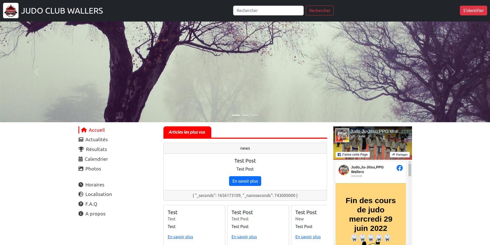

## Judo Club Wallers compose application

### VueJS + NestJS

  

[_docker-compose.yml_](docker-compose.yml)

```

services:

server:

image: aredli/judo-club-wallers-backend

restart: always

ports:

- 3000:3000

  

client:

image: aredli/judo-club-wallers-frontend

restart: always

ports:

- 80:8080

  

```

  

When deploying the application, docker compose maps port 8080 of the web service container to port 8080 of the host as specified in the file. It also maps port 3000 for the server.

Make sure port 8080 and 3000 on the host is not already being in use.

  
  

The server uses the **firebase admin SDK**. It is therefore necessary to define the variables in a "*server.env*" file like this:

  

```

TYPE=

PROJECT_ID=

PRIVATE_KEY_ID=

PRIVATE_KEY:

CLIENT_EMAIL=

CLIENT_ID=

AUTH_URI=

TOKEN_URI=

AUTH_PROVIDER_X509_CERT_URL=

CLIENT_X509_CERT_URL=

```

If you do not create the file and do not define each of the variables, an error will be returned to you:

  

judo-club-wallers-server-1 | FirebaseAppError: Service account object must contain a string "project_id" property.

  
  
  

## Deploy with docker compose

  

    $ docker compose up -d

    [+] Running 0/2

    ⠿ client Pulling
    
    ⠿ server Pulling

    ⠿ Container judo-club-wallers-server-1 Creating
    
    ⠿ Container judo-club-wallers-client-1 Creating
    
    judo-club-wallers-server-1 |
    
    judo-club-wallers-server-1 | > judo-club-wallers-backend@0.0.1 start:prod
    
    judo-club-wallers-server-1 | > node dist/main
    
    judo-club-wallers-server-1 |
    
    judo-club-wallers-client-1 | INFO: Accepting connections at http://localhost:8080
    
    judo-club-wallers-server-1 | [Nest] LOG [NestApplication] Nest application successfully started

  

## Expected result

  

Listing containers must show one container running and the port mapping as below:


    $ docker ps

    CONTAINER ID IMAGE                              COMMAND               CREATED       STATUS       PORTS                 NAMES
    
    29baab76985c aredli/judo-club-wallers-frontend "docker-entrypoint.s…" 3 minutes ago Up 3 seconds 0.0.0.0:80->8080/tcp, :::80->8080/tcp judo-club-wallers-client-1
    
    57ed2caf1184 aredli/judo-club-wallers-backend "docker-entrypoint.s…" 3 minutes ago Up 3 seconds 0.0.0.0:3000->3000/tcp, :::3000->3000/tcp judo-club-wallers-server-1


  

After the application starts, navigate to `http://localhost:80` in your web browser.

  



  

Stop and remove the containers


    $ docker compose down
    
    [+] Running 3/3
    
    ⠿ Container judo-club-wallers-client-1 Removed
    
    ⠿ Container judo-club-wallers-server-1 Removed
    
    ⠿ Network judo-club-wallers_default Removed
